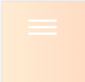

## README（Css组件）

@(README.md)

### 简介
**本仓库启动日期：**
* `2019年3月22日`

**内容说明：**
* 主要用于存储个人编写的前端各种实用前端UI小组件（当然也欢迎大佬们提交组件）
* 全部组件均为自适应
* 大量使用Css3动画，让页面过渡更加柔顺
	* Css3动画已兼容谷歌、Safari等使用Webkit引擎的浏览器
* 没有数据的需求，所以Js方面只使用jq用于dom操作

**其余信息注释：**
* 后面应该会加入一小部分的css3的教程，敬请期待！
* 更多精彩效果，敬请探索我的小站[www.messys.top](www.messys.top)

### 组件展示
>loading动画

>选项打开关闭动画

>导航栏

### 最后
感觉这个仓库应该会经常更新的，因为不用手动删除一些隐私信息什么的，而且我又是一个喜欢经常修改UI页面的人。

如果你喜欢本仓库,那就帮忙点一个Star吧！

今天就先到这里，最后一次README修改时间`2019年3月2日22点34分`
